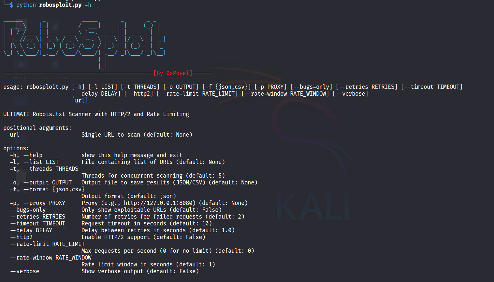

<h1 align="center">RoboSploit - Robots.txt Tester Pro</h1>

<p align="center"></p>

## Connect
[](https://www.linkedin.com/in/zabed-ullah-poyel/)
[](https://medium.com/@zabedullahpoyel)
[](https://www.youtube.com/@XploitPoy-777)
[](https://x.com/zabedullahpoyel)
[](https://zabedullahpoyel.com)
[](mailto:zabedullahpoyelcontact@gmail.com)

## Description
This tool fetches and analyzes the `robots.txt` file of a target domain and tests the listed `"Disallow"` paths for unauthorized access using a variety of bypass techniques. It helps identify potential misconfigurations, exposed endpoints, or access control flaws.

Ideal for reconnaissance during bug bug bounty hunters and penetration testers or professional security assessments.

## Features

| Category              | Capabilities |
|-----------------------|--------------|
| **Bypass Techniques** | 34+ IP spoofing headers, 60+ path traversal variants, HTTP method fuzzing (GET, POST, PUT, etc.) |
| **Protocol Support**  | HTTP/1.1 and HTTP/2 with optional upgrade |
| **Performance**       | Multi-threaded scanning, Rate limiting control, Retry mechanism with backoff |
| **Reporting**         | JSON/CSV outputs with full response metadata |
| **Stealth**           | Proxy support, User-agent rotation |
| **Robots.txt Analysis** | Auto-discovery of disallowed paths, Recursive variant testing on blocked paths |
| **Access Control Testing** | Detects misconfigurations like open admin panels or bypassable forbidden paths |
| **Usability**         | Command-line interface, Colored terminal output (colorama), Graceful shutdown on Ctrl+C |
| **Customization**     | Configurable timeouts, delays, retries, threads, and headers |


## Tools Required

1. Python 3.6 or higher
   - Make sure Python is installed and available in your system PATH

2. Required Python Libraries:
   - requests
   - colorama
   - argparse (built-in with Python 3+)
   - urllib3

3. (Optional) Proxy Tools:
   - Burp Suite or OWASP ZAP (for manual testing or proxy chaining)

4. Internet Connection
   - Required to make HTTP/HTTPS requests to target URLs

License: MIT

## Installation Instructions
```bash
# Clone the repository
git clone https://github.com/XploitPoy-777/RoboSploit.git
cd RoboSploitr

# (Optional) Create a virtual environment
python3 -m venv venv
source venv/bin/activate

# Install dependencies
pip install -r requirements.txt --break-system-packages

```
## Usage Instructions
```bash
# Full power: multi-threaded, HTTP/2, proxy, retry, custom output, and bug-only view
python3 robosploit.py -l urls.txt -t 10 --http2 --proxy http://127.0.0.1:8080 \
--retries 3 --timeout 12 --bugs-only -o output.json -f json

# Basic Usage
python3 robosploit.py https://example.com
# Scan Multiple Targets
python3 robosploit.py -l targets.txt
# Save Results to JSON
python3 robosploit.py https://example.com -o results.json -f json
# Use Proxy & Enable HTTP/2
python3 robosploit.py https://example.com -p http://127.0.0.1:8080 --http2
# Show Only Vulnerable Endpoints
python3 robosploit.py https://example.com --bugs-only
```
## Output
- Example Output (Terminal)
```less
[+] GET BYPASSED (Header:X-Real-IP): https://target.com/admin
[+] Vulnerable paths found for https://target.com:
  - GET /admin (Bypass: Header:X-Real-IP)
  - POST /backup (Bypass: PathVariant:/backup%00.json)
```
- Example Output (JSON)
```json
[
  {
    "url": "https://target.com",
    "timestamp": "2025-04-21 14:22:01",
    "accessible_paths": [
      {
        "path": "https://target.com/admin",
        "method": "GET",
        "status": 200,
        "length": 5321,
        "bypass_technique": "Header:X-Real-IP",
        "effective_url": "https://target.com/admin",
        "http_version": "2"
      }
    ]
  }
]
```
## ⚠️ Reminder
This tool is intended for use only on systems you have explicit permission to test. Unauthorized scanning is illegal and unethical. Always follow the rules of engagement when working on bug bounty platforms or client assessments.
